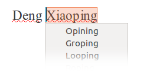

en-global: the global spellchecker project
==========================================

English is one of the world's global languages, widely used as a lingua franca. But most English spellcheckers are tailored to a particular region, such as Canada, the UK or the US. What if you need to use names from outside one region? Whichever spellchecker you choose, you'll get you'll get red underlines all over your text, or worse still, comical or offensive miscorrections.

en-global is designed to solve this problem. It's an English spellchecker with support for global placenames and personal names. This opens the user to the rich and dynamic English-language vocabulary used the world over. So wherever you are, you can use the words that suit you best.

Also supported are different spelling rules. Color or colour? Tire or tyre? Enrolment or enrollment? It depends where you live! So en-global doesn't try and make this decision for you: it accepts either variant. As well as being useful to beginners and second language users, it is important in any international context where more than one variety may be in use.

Some users may feel that choosing en-global is a personal statement. Perhaps they may want to project their ideas across the globe, so that all people can share them. en-global is designed to facilitate this.

colokr
color
cvolour
colour
colur

en-global achieves a high level of mistake detection: the vast majority of possible spelling mistakes are not valid proper names or regional spelling variants.

If you're an application developer, consider choosing en-global to support English users across the globe. It frees them from configuring the correct regional spellchecker, and contains the widest available coverage of the words they will use.

en-global is available now and is open-source. Broader regional coverage is being developed continually.
